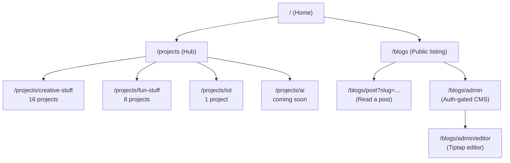
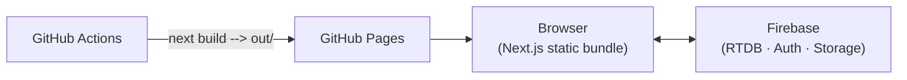

# 🚀 Vikas Yadav: An Operating System for Projects

<p align="center">
  
  
  
  
  
  
  
</p>

<p align="center">
  <strong>A high-performance personal portfolio showcasing the intersection of AI/ML, Creative Coding, and Web Security — 25+ self-contained project "micro-apps" plus a full blogging platform.</strong>
  <br />
  <a href="https://vikasyadavnsit.github.io">🏠 Live Website</a> •
  <a href="docs/ARCHITECTURE.md">🏗️ Architecture</a> •
  <a href="docs/SETUP.md">🔧 Setup Guide</a> •
  <a href="docs/PROJECTS.md">📦 Full Project Catalog</a>
</p>

<!-- SCREENSHOT: Home page hero section -->
<!--  -->

---

## 📖 Table of Contents

- [Vision](#-vision)
- [Site Map](#-site-map)
- [Featured Project Domains](#-featured-project-domains)
- [Blog](#-blog)
- [Technical Deep Dives](#-technical-deep-dives)
- [Tech Stack](#-tech-stack)
- [Architecture at a Glance](#-architecture-at-a-glance)
- [Getting Started](#-getting-started)
- [Documentation](#-documentation)

---

## 🌟 Vision

<div id="-vision"></div>

This isn't just a portfolio—it's a decentralized hub for engineering excellence. Every project is built as a semi-autonomous "micro-app" with a heavy focus on **client-side execution**, **zero-latency**, and **privacy-first logic**. The site itself is a fully static export (no application server), with Firebase as the only backend, used selectively where cross-device state is genuinely needed.

---

## 🗺️ Site Map

<div id="-site-map"></div>



<!-- SCREENSHOT: Projects hub page showing the 4 category cards -->
<!--  -->

---

## ✨ Featured Project Domains

<div id="-featured-project-domains"></div>

Full details, tech stack, and screenshots for every project live in **[`docs/PROJECTS.md`](docs/PROJECTS.md)**. Quick overview by category:

### 🎨 Creative Stuff — Productivity Engines (16 projects)
`/projects/creative-stuff`

<!-- SCREENSHOT: Creative Stuff category listing page -->
<!--  -->

| Project | One-liner |
|---|---|
| [Algorithm Arena](docs/PROJECTS.md#14-algorithm-arena) | LeetCode-style IDE for JS, TS, Python, Java, C++, and Go with a custom resizable 3-pane layout |
| [Workflow Builder](docs/PROJECTS.md#13-workflow-builder) | No-code visual automation engine built on React Flow |
| [File Transfer](docs/PROJECTS.md#16-file-transfer) | Move files between devices with zero server — via QR codes or audio tones *(newest)* |
| [Digital Whiteboard](docs/PROJECTS.md#1-digital-whiteboard) | Real-time collaborative canvas with shareable notebooks |
| [Flagbase](docs/PROJECTS.md#12-flagbase) | Full feature-flag management platform with a JS SDK |
| [Notable Notes](docs/PROJECTS.md#15-notable-notes) | Markdown notes with live preview and PDF/ZIP export |
| [Security Suite: File Encryptor](docs/PROJECTS.md#8-file-encryptor) & [Password Vault](docs/PROJECTS.md#10-password-vault) | AES-256-GCM encryption entirely via the browser's `SubtleCrypto` API |
| [TOTP Authenticator](docs/PROJECTS.md#6-totp-authenticator) | Web-based 2FA with QR scanning and local HMAC code generation |
| [RequestLab](docs/PROJECTS.md#11-requestlab) | In-browser API client — a Postman alternative |
| [Internet Speed Test](docs/PROJECTS.md#9-internet-speed-test) | Throughput/ping/jitter testing with historic charts |
| [Task Manager](docs/PROJECTS.md#7-task-manager), [Scratchpad](docs/PROJECTS.md#2-scratchpad), [URL Shortener](docs/PROJECTS.md#5-url-shortener), [QR Login](docs/PROJECTS.md#3-qr-based-remote-login), [Global Chat Hub](docs/PROJECTS.md#4-global-chat-hub) | Everyday utilities — see the catalog for details |

### 🎮 Fun Stuff — AI & AR Toys (8 projects)
`/projects/fun-stuff`

<!-- SCREENSHOT: Fun Stuff category listing page -->
<!--  -->

| Project | One-liner |
|---|---|
| [Fruit Ninja](docs/PROJECTS.md#3-fruit-ninja) | Real-time MediaPipe hand-tracking maps your finger to a virtual blade |
| [AI Baby Monitor](docs/PROJECTS.md#2-ai-baby-monitor) | On-device TensorFlow.js person detection + cry analysis, 100% private |
| [3D Earth](docs/PROJECTS.md#8-3d-earth) | Interactive globe with real country/city/river/mountain data, space-to-street zoom |
| [OpenMeet](docs/PROJECTS.md#7-openmeet) | WebRTC video calls — Firebase used only for signaling, never media |
| [Family Tree](docs/PROJECTS.md#5-family-tree) | Interactive, shareable family trees with PNG export |
| [Talking Characters](docs/PROJECTS.md#1-talking-characters), [Eternal Journey](docs/PROJECTS.md#4-eternal-journey), [Webcam Pan & Zoom](docs/PROJECTS.md#6-webcam-pan--zoom) | See the catalog for details |

### 🔌 IoT (1 project)
`/projects/iot`

| Project | One-liner |
|---|---|
| [IoT Bridge](docs/PROJECTS.md#1-iot-bridge) | IFTTT-style "if this, then that" rule builder for connected devices |

### 🤖 AI
`/projects/ai` — placeholder page, more projects coming soon.

---

## 📝 Blog

<div id="-blog"></div>

`/blogs` — a full blogging platform built into the site, not a static Markdown/MDX folder:

- **Public reading experience:** post listing with year archives, tags, reading-time estimates, view counters, a share bar, table of contents, and an image lightbox for post content.
- **Content engine:** every post is stored in **Firebase Realtime Database** (not in the repo), authored through a **Tiptap-based rich text editor** with custom figure/image blocks, and sanitized with DOMPurify before rendering.
- **Admin CMS:** `/blogs/admin` is gated behind Firebase **email/password authentication** (`components/blog/AuthGate.tsx`) — only a signed-in admin can create, edit, or delete posts.
- Because content is fully dynamic, there's no static list of post titles here — see the [Architecture doc](docs/ARCHITECTURE.md#data-architecture) for how the CMS is wired up.

<!-- SCREENSHOT: Blog public listing page -->
<!--  -->

---

## 🔍 Technical Deep Dives

<div id="-technical-deep-dives"></div>

<details>
<summary><b>1. Fruit Ninja: Hand-Tracking Game Loop</b></summary>
<br>

- **Initialization:** MediaPipe `hand_landmarker` task loads in a Web Worker to keep the UI thread smooth.
- **The Tracking Loop:** `requestAnimationFrame` captures frames → MediaPipe identifies 21 landmarks → Landmark 8 (Index Tip) coordinates are mapped to the game canvas.
- **Game Engine:** Custom physics engine manages fruit spawning, gravity, and bounding-box collision detection.
- **Audio:** Real-time oscillators synthesize "woosh" and "splat" sounds, keeping the sound-effects footprint under 50KB.
</details>

<details>
<summary><b>2. Workflow Builder: Visual Logic Execution</b></summary>
<br>

- **Visual State:** Managed via **React Flow** context with persistent storage in **IndexedDB**.
- **Execution Engine:** A depth-first traverser walks the node graph.
  - **HTTP Nodes:** Execute client-side `fetch`.
  - **Code Nodes:** Execute user scripts in a sandboxed environment using `new Function()`.
  - **Transform Nodes:** Data mapping using JSONPath logic.
</details>

<details>
<summary><b>3. Security Suite: Zero-Knowledge Flow</b></summary>
<br>

- **Key Derivation:** Master Password + Salt → `PBKDF2` (100,000 iterations) → 256-bit AES Key.
- **Encryption:** `crypto.subtle.encrypt` using AES-GCM mode for authenticated encryption.
- **Storage:** Only the Initialization Vector (IV), Salt, and Encrypted Blob are stored — the data is useless without the original master password.
</details>

<details>
<summary><b>4. Algorithm Arena: Multi-Language Simulation</b></summary>
<br>

- **Execution Model:** Native `new Function()` execution for JS/TS.
- **Logic Mapping:** Regex-based transpilation layers for Python, Java, C++, and Go map idiomatic constructs (e.g., `fmt.Println`, `vector<int>`) to JavaScript execution logic.
- **UI Architecture:** Custom-built `ResizablePane` component manages a draggable 3-pane layout without external libraries.
- **Persistence:** Real-time state syncing with `localStorage` ensures user code survives refreshes and language switches.
</details>

<details>
<summary><b>5. File Transfer: Serverless Device-to-Device Handoff</b></summary>
<br>

- **QR Mode:** The file is chunked and rendered as a rotating sequence of QR codes (`qrcode.react`); the receiver scans each frame with the camera via `jsqr`, reassembling the file client-side.
- **Audio Mode:** Data is encoded as a sequence of tones (FSK-style modulation, `lib/audio/modulator.ts`) with a handshake protocol, played through the sender's speaker and decoded from the receiver's microphone (`lib/audio/demodulator.ts`).
- **Bundling:** Multi-file transfers are zipped client-side (`jszip`, `lib/zipBundle.ts`) before encoding.
</details>

---

## 🛠️ Tech Stack

<div id="-tech-stack"></div>

- **Core:** [Next.js 16 (App Router)](https://nextjs.org/), React 19, TypeScript, Tailwind CSS, Framer Motion.
- **AI/ML:** MediaPipe (`@mediapipe/tasks-vision`) & TensorFlow.js.
- **Graphics:** Three.js (3D), P5.js (2D canvas), custom `<canvas>` engines (Whiteboard, Fruit Ninja).
- **Realtime/Backend:** Firebase (Realtime Database, Auth, Storage) — the only backend service used site-wide.
- **Content/Editor:** Tiptap (rich text editing), `marked` (Markdown), `mermaid` (in-note diagrams), DOMPurify (HTML sanitization), `highlight.js`.
- **Data/Comms:** `@xyflow/react` (React Flow), `jsqr` / `qrcode.react` (QR encode/decode), `otpauth` (TOTP), Web Audio API (tone modulation, audio effects), `recharts` (charts), `jszip`, `jspdf`/`html2pdf.js`/`html2canvas` (export).
- **Client-side persistence:** IndexedDB, `localStorage`, Web Crypto (`SubtleCrypto`) for encryption.
- **Deployment:** [GitHub Actions](.github/workflows/nextjs.yml) building a static export (`output: 'export'`) to GitHub Pages.

---

## 🏗️ Architecture at a Glance

<div id="-architecture-at-a-glance"></div>

The site is a fully static export with Firebase as its only backend, deployed automatically to GitHub Pages on every push to `master`:



Full breakdown — routing decisions, component structure, the blog's data model, and the CI/CD pipeline — lives in **[`docs/ARCHITECTURE.md`](docs/ARCHITECTURE.md)**.

---

## 🔧 Getting Started

<div id="-getting-started"></div>

```bash
# Clone the repository
git clone https://github.com/vikasyadavnsit/vikasyadavnsit.github.io.git
cd vikasyadavnsit.github.io

# Install dependencies
npm install

# Run the dev server
npm run dev
```

For Firebase configuration, camera/mic testing on mobile via tunnels, static export previews, and the full deployment flow, see **[`docs/SETUP.md`](docs/SETUP.md)**.

---

## 📚 Documentation

<div id="-documentation"></div>

| Doc | Covers |
|---|---|
| [`docs/ARCHITECTURE.md`](docs/ARCHITECTURE.md) | Routing, component architecture, theming, data model, build/deploy pipeline, security notes |
| [`docs/SETUP.md`](docs/SETUP.md) | Prerequisites, install, Firebase setup, dev server, build, deployment, troubleshooting |
| [`docs/PROJECTS.md`](docs/PROJECTS.md) | Every project (25 total), one section each, with route/description/tech stack |

---

<p align="center">
  Developed with 💻 by <a href="https://github.com/vikasyadavnsit"><strong>Vikas Yadav</strong></a>
  <br />
  <em>Pushing the limits of what's possible in a browser.</em>
</p>
