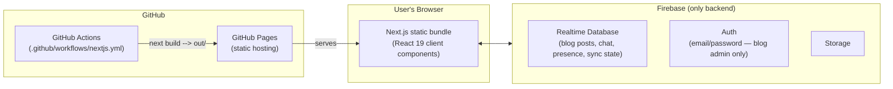
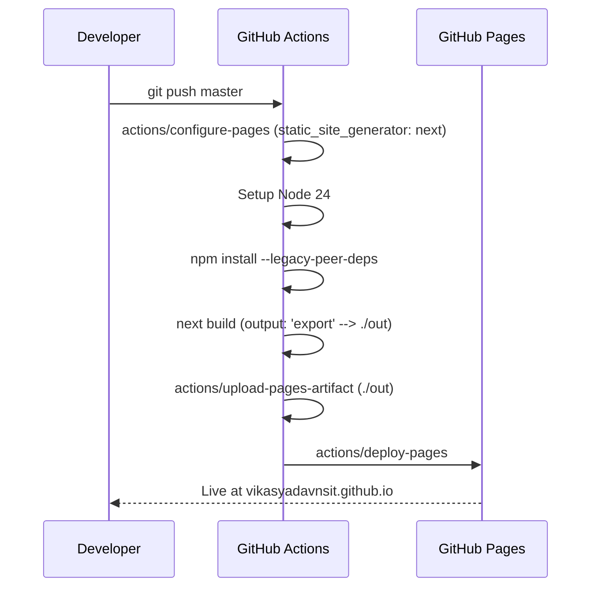

# 🏗️ Architecture

How this portfolio is put together: routing, components, theming, data, and deployment.

## Table of Contents

- [System Overview](#system-overview)
- [Routing Architecture](#routing-architecture)
- [Component Architecture](#component-architecture)
- [Vendored Sub-Apps](#vendored-sub-apps)
- [Theming System](#theming-system)
- [Data Architecture](#data-architecture)
- [Build & Deployment Pipeline](#build--deployment-pipeline)
- [Security Notes](#security-notes)

---

## System Overview

This is a **100% client-side, statically-exported** site — there is no application server. `next.config.mjs` sets `output: 'export'`, so `next build` emits a fully static `out/` directory of HTML/JS/CSS that GitHub Pages serves directly. The only backend in the entire system is **Firebase** (Realtime Database, Auth, and Storage), used selectively by projects that need cross-device state (chat, QR login, whiteboard sync) and by the blog CMS.

There is no custom API layer except a single route, `app/api/workflow-proxy/route.ts`, used by the Workflow Builder project's HTTP node (a thin server-side proxy so client-side flows can make cross-origin requests during local development — note this route is not part of the static export and only runs when the app is server-hosted, e.g. via `next dev`/`next start`).

## Routing Architecture

Everything lives under Next.js's **App Router** (`app/`):

- `app/page.tsx` — the home page, composing `Navbar`, `Hero`, `BentoGrid`, `Experience`, `EducationAndAwards`, `Projects`, and `Contact`.
- `app/projects/<category>/page.tsx` — one listing page per category (`ai`, `iot`, `creative-stuff`, `fun-stuff`).
- `app/projects/<category>/<slug>/page.tsx` — one route per individual project (see [`PROJECTS.md`](PROJECTS.md) for the full list).
- `app/blogs/**` — the blog section (listing, post view, admin).
- Utility routes: `app/not-found.tsx`, `app/error/page.tsx`, `app/unauthorised/page.tsx`, plus `app/robots.ts`/`app/sitemap.ts` for SEO.

**Why there's no `[slug]` dynamic route for blog posts:** static export can only pre-render dynamic segments known at build time (via `generateStaticParams`), which doesn't fit a live, editable CMS. Instead, `app/blogs/post/page.tsx` is a plain client component that reads `?slug=` from `useSearchParams` and resolves the post at runtime by querying Firebase directly (`getPostBySlugOrId` in `lib/blog/firebase-blog.ts`). Every "project" route, by contrast, is a hand-authored static folder — there's no CMS or catch-all route for projects.

## Component Architecture

- **Layout/Navigation:** `components/sections/Navbar.tsx`, `components/ThemeContext.tsx` (site-wide theme provider), `components/DevToolsProtection.tsx`.
- **Home page sections** (`components/sections/`): `Hero`, `BentoGrid` (skills/expertise grid), `Experience`, `EducationAndAwards`, `Projects` (the featured-projects showcase — its data is defined inline in this file, separate from the full catalog in `app/projects/**`), `Contact`.
- **Blog components** (`components/blog/`): the largest component group — `BlogCard`, `AuthGate` (admin login gate), `BlogThemeContext`/`BlogThemeToggle` (a theme system independent of the site-wide one), `RichTextEditor` (Tiptap), `TableOfContents`, `ReadingProgress`, `TagPills`, `ViewCounterBadge`, `ShareBar`, `PostFooterNav`, `AttachmentList`, `Lightbox`, `SearchBar`.
- **Per-project micro-apps:** every project under `app/projects/<category>/<slug>/` is self-contained — its own `components/`, sometimes `lib/` and `layout.tsx`, scoped entirely to that route. There is no shared "project UI kit"; each project owns its full component tree. This keeps projects independently deletable/replaceable without touching shared code.
- There is no `components/ui/` primitives folder (no shadcn-style design system) — styling is done directly with Tailwind utility classes plus the CSS-variable theme tokens described below.

## Vendored Sub-Apps

Two Fun Stuff projects — **OpenMeet** (`app/projects/fun-stuff/open-meet/`) and **Webcam Pan & Zoom** (`app/projects/fun-stuff/webcam-pan-zoom/`) — are standalone Vite/React applications vendored wholesale into the repo, each with its own `package.json`, `node_modules/`, `src/`, and `dist/`. They are explicitly excluded from the root `tailwind.config.ts` content globs so their own build output/styles don't leak into (or get purged by) the main site's Tailwind pipeline. Functionally they're embedded as static bundles rather than native Next.js pages.

## Theming System

- **Site-wide theme:** `components/ThemeContext.tsx` toggles light/dark mode, backed by CSS custom properties defined in `app/globals.css` (`--background`, `--foreground`, `--primary`, `--secondary`, `--destructive`, `--muted`, `--accent`, `--popover`, `--card`, `--border`, `--input`, `--ring`). `tailwind.config.ts` maps each Tailwind color token to `hsl(var(--token))`, so a single CSS-variable swap re-themes every Tailwind class site-wide. Border radii similarly derive from one `--radius` variable.
- **Blog theme:** the blog section has its **own** parallel theme system (`BlogThemeContext`/`BlogThemeToggle` + `--blog-*` variables, e.g. `--blog-fg`, `--blog-accent`, `--blog-border`) defined in `app/blogs/blog-theme.css`, deliberately decoupled from the main site so the blog can have a distinct reading-focused look.
- Font: Inter, loaded via `next/font/google` in `app/layout.tsx`.
- Plugin: `@tailwindcss/typography`, used for blog post prose rendering.

## Data Architecture

Two very different data models coexist:

**1. Projects — static, inline, no CMS.** Each category listing page (`app/projects/creative-stuff/page.tsx`, `fun-stuff/page.tsx`, `iot/page.tsx`, `ai/page.tsx`) defines its own array of project metadata (`title`, `description`, `link`, `icon`, `color`) directly in the file. There's no `projects.json`/`projects.ts`; adding a project means adding an array entry plus a new route folder. See [`PROJECTS.md`](PROJECTS.md) for the full, human-readable catalog.

**2. Blog — dynamic, Firebase-backed CMS.**
- `lib/blog/types.ts` defines the `BlogPost` model: `id`, `title`, `slug`, `excerpt`, `contentHtml`, `coverImageUrl`, `tags`, `attachments`, `author`, `published`, `createdAt`/`updatedAt`/`publishedAt`, `viewCount`.
- `lib/blog/firebase-blog.ts` is the data-access layer: CRUD operations plus `subscribeToPosts` (live updates), `getPostBySlugOrId`, and `incrementViewCount`, all reading/writing the `blogs/posts` path in Firebase Realtime Database.
- Cover and inline images are stored as **base64 data URIs directly on the post record** (compressed client-side via `lib/blog/image-compress.ts` before saving) rather than as separate Storage objects with URLs.
- Supporting utilities: `lib/blog/slug.ts` (slug generation), `lib/blog/reading-time.ts`, `lib/blog/sanitize.ts` (DOMPurify sanitization of rendered HTML), `lib/blog/file-utils.ts`, `lib/blog/tiptap-figure-image.ts` (a custom Tiptap node for figure/image blocks).
- Authoring happens through `app/blogs/admin/editor/page.tsx`, a Tiptap-based rich text editor, gated by `components/blog/AuthGate.tsx` using Firebase **email/password Authentication** — only a signed-in Firebase Auth user can create/edit posts.

There are no static blog post files (no MDX, no seed JSON) anywhere in the repo — all post content lives exclusively in the live Firebase database at runtime.

## Build & Deployment Pipeline

`.github/workflows/nextjs.yml` runs on every push to `master` (and via manual `workflow_dispatch`):

The `build` job also caches `.next/cache` between runs to speed up rebuilds. `--legacy-peer-deps` is required because some dependencies haven't yet published peer-dep ranges compatible with React 19. `images.unoptimized: true` in `next.config.mjs` is required because static export has no server to run Next's image-optimization API on.

## Security Notes

- **`DevToolsProtection.tsx`** exists to discourage casual DevTools/inspection use, but is currently **disabled** via an internal `DISABLE_PROTECTION` flag.
- **The Firebase config in `lib/firebase.ts` is hardcoded and intentionally public** — this is expected and safe by Firebase's design: the web `apiKey`/config object is a client identifier, not a secret. Actual access control is enforced server-side via Firebase Realtime Database security rules and Firebase Auth, not by hiding this config. See [`SETUP.md`](SETUP.md) for what you'd need to change if standing up your own Firebase backend.

---

  <a href="../README.md">← Back to README</a> · <a href="PROJECTS.md">Project Catalog</a> · <a href="SETUP.md">Setup</a>

